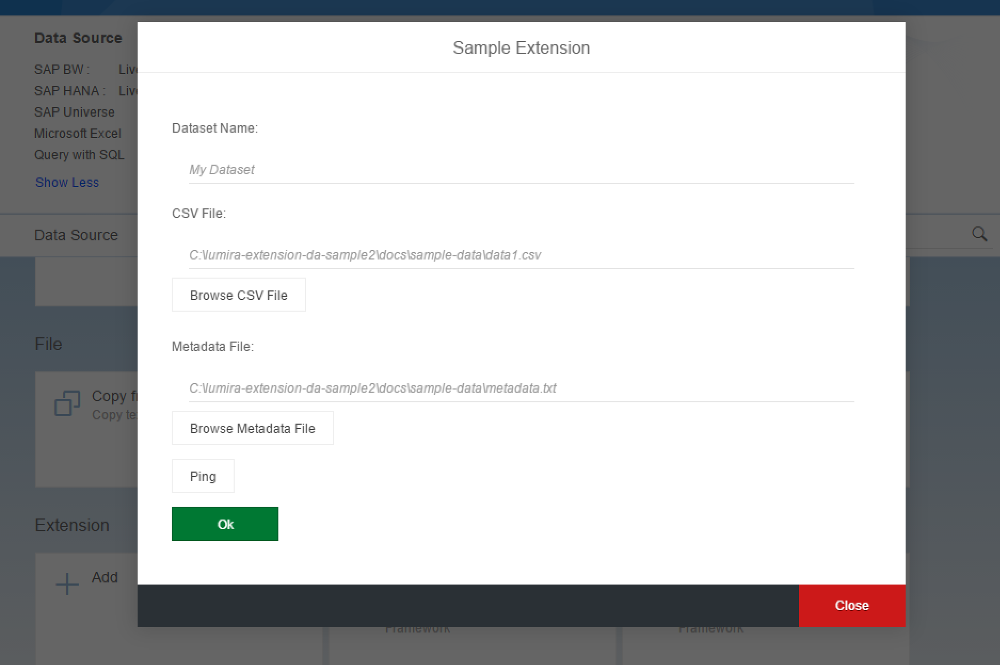
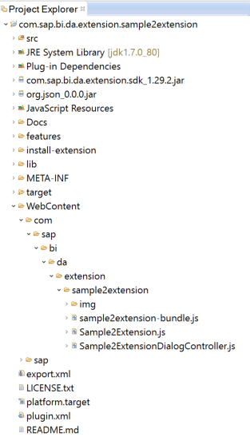
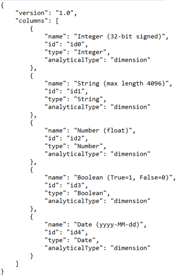

## Sample Data Access Extension
We have a sample Data Access Extension you can explore and use as a starter project, hosted on Github at http://www.github.com/SAP/lumira-extension-da-sample. The extension zip file can be downloaded [here](https://github.com/SAP/lumira-extension-da-sample/blob/master/install-extension/com.sap.lumira.sampleextension_1.29.2.201601041448.zip), and you can follow the instructions on ‘“Installing Data Access Extensions” in the [Overview](./README.md) to try it out. 

In this sample extension you can input a name for your dataset and browse your drive for a CSV file to import into Lumira, as well as its metadata .txt file  (sample files included). The sample extension also showcases how you can send requests from the JavaScript client to receive responses from the Java backend.

 

### User Interface (client)
The user interface in this sample extension uses SAP OpenUI5. We recommend OpenUI5, as it is native to the SDK and allows you to create a seamless user experience that is congruent with Lumira. However, you are able to use any libraries you like!

(If you have used or built Data Access Extensions with OpenUI5 before, note that SAP BusinessObjects Lumira Discovery does not support components from the sap.ui.commons library ---- please use the sap.m library instead).

Let’s take a look at the client-side code.

To access the JavaScript, we navigate to: 

WebContent > com > sap > bi > da > extension > sampleextension



There are two files here that create the user interface: 

SampleExtension.js & SampleExtensionDialogController.js

###### SampleExtension.js

SampleExtension.js is mostly boilerplate required for the extension to run, so there are just a couple things to highlight:
This file launches the extension dialog (that we will create in SampleExtensionDialogController.js), and we return a Promise. If the execution is successful, we resolve the Promise. Otherwise, the Promise is rejected (more on this in the next section).

```javascript
var createSample2ExtensionDialog = function(acquisitionState, workflow) {
	var oDeferred = new jQuery.Deferred();
	var controller = new Sample2ExtensionDialogController(acquisitionState, oDeferred, fServiceCall, workflow);
	controller.showDialog();
	return oDeferred.promise();
};
```

This file also gives you control over particular workflows: “CREATE” when you originally open the extension, or “EDIT”  and “REFRESH” when you have already imported the data.

```javascript
// This function will be called during a create dataset workflow
// This function must immediately return a promise object
// When the extension is finished performing UI tasks, resolve the promise with the acquisitionState and dataset name
// Other workflows do not need the dataset name
// The resolved acquisitionState will be passed to the extension Java backend getDataAcquisitionJobContext()
this.doCreateWorkflow = function(acquisitionState) {
    return createSample2ExtensionDialog(acquisitionState, "CREATE");
};

// This function will be called during an edit dataset workflow
this.doEditWorkflow = function(acquisitionState) {
    return createSample2ExtensionDialog(acquisitionState, "EDIT");
};

// This function will be called during a refresh workflow
// This function should refresh the dataset with existing parameters
// Minimal UI should be shown, if any
this.doRefreshWorkflow = function(acquisitionState) {
    var oDeferred = new jQuery.Deferred();
    oDeferred.resolve(acquisitionState);
    return oDeferred.promise();
};
```

###### SampleExtensionDialogController.js

This file is where the user interface is created, and where most of your client-side changes will be made. 

First, we create the dialog that will pop-up when the extension is launched. The dialog will have a cancel button that rejects the Promise, and closes the dialog.

```javascript
//Create dialog

//button to close the dialog
var closeDialogButton = new sap.m.Button({
    text: "Close",
    type: "Reject",
    width: "100px",
    press: function() {
        if (oDeferred.state() == "pending") {
            this.destroy();
            oDeferred.reject();
        }
        dialog.close();
    }
});

var dialog = new sap.m.Dialog({
    contentWidth: "720px",
    contentHeight: "480px",
    title: "Sample Extension",
    endButton: closeDialogButton
});
```

Next, we add text fields and browse buttons from the OpenUI5 sap.m library to get parameters from user input.
 
```javascript
 //Create dialog controls and add them to the dialog

var datasetNameLabel = new sap.m.Label({
    text: "Dataset Name:",
    labelFor: datasetNameText
});

dialog.addContent(datasetNameLabel);

var datasetNameText = new sap.m.Input({
    width: "100%",
    placeholder: "My Dataset"
});

dialog.addContent(datasetNameText);

var csvFileLabel = new sap.m.Label({
    text: "CSV File:",
    labelFor: csvFileText
});

dialog.addContent(csvFileLabel);

var csvFileText = new sap.m.Input({
    width: "100%",
    placeholder: "C:\\lumira-extension-da-sample2\\docs\\sample-data\\data1.csv"
});

dialog.addContent(csvFileText);

//opens the file explorer for the user to browse their computer for a csv file
var browseForCSV = function(csvFileText, oEvent) {
    var ext = window.viMessages.getText("CSV") + "\0*.csv";
    var filePath = app.fileOpenDialog(ext);
    if (filePath) {
        csvFileText.setValue(filePath);
        var fileName = filePath.replace(/^.*[\\\/]/, '');
        fileName = fileName.substr(0, fileName.lastIndexOf('.'));
        datasetNameTxt.setValue(fileName);
    }
};

var browseCSVButton = new sap.m.Button({
    text: "Browse CSV File",
    press: browseForCSV.bind(this, csvFileText)
}).addStyleClass("sample-da-button");

dialog.addContent(browseCSVButton);

var metadataFileLabel = new sap.m.Label({
    text: "Metadata File:",
    labelFor: metadataFileText
});

dialog.addContent(metadataFileLabel);

var metadataFileText = new sap.m.Input({
    width: "100%",
    placeholder: "C:\\lumira-extension-da-sample2\\docs\\sample-data\\metadata.txt"
});

dialog.addContent(metadataFileText);

//opens the file explorer for the user to browse their computer for metadata txt file
var browseForMetadata = function(metadataFileText, oEvent) {
    var ext = window.viMessages.getText("txt") + "\0*.txt";
    var filePath = app.fileOpenDialog(ext);
    if (filePath) {
        metadataFileText.setValue(filePath);
    }
};

var browseMetadataButton = new sap.m.Button({
    text: "Browse Metadata File",
    press: browseForMetadata.bind(this, metadataFileText)
}).addStyleClass("sample-da-button");

dialog.addContent(browseMetadataButton);

```

When the user presses the “ok” button, we store the parameters in the “info” object. We then store that in “acquistionState” ---- which allows us to pass these parameters to the Java backend. Lastly, we resolve the Promise and close the dialog. 

```javascript
function okButtonPressed() {
            var info = {};
            info.csv = csvFileText.getValue();
            info.metadata = metadataFileText.getValue();
            info.datasetName = datasetNameText.getValue();
            acquisitionState.info = JSON.stringify(info);
            oDeferred.resolve(acquisitionState, datasetNameText.getValue());
            dialog.close();
        };

var okButton = new sap.m.Button({
    text: "Ok",
    type: "Accept",
    width: "100px",
    press: okButtonPressed
}).addStyleClass("sample-da-button");

dialog.addContent(okButton);
```

We could alternatively use the “runtimeInfo” object here rather than “info”, if we do not want the user’s parameters to save along with the document. Instead “runtimeInfo” resets when you close, to protect potentially sensitive input like passwords.

Here, we use fServiceCall() to send a request “ping” to the backend when the button is pressed. The backend then evaluates that request and sends back a response “pong”. If we successfully receive a response, we show it in a message box. Otherwise, we show an error. You can leverage fServiceCall() in many ways if your extension needs to communicate back and forth between the client and backend. 

```javascript
//sends a request to the backend and receives a response
var pingButton = new sap.m.Button({
    text: "Ping",
    press: function() {
        fServiceCall("ping", function(response) {
        	//Lumira 1.x does not have sap.m.MessageBox: so here we first check if it is present, 
        	//and use the sap.ui.commons.MessageBox if not
            sap.m.MessageBox ? sap.m.MessageBox.alert(response) : sap.ui.commons.MessageBox.alert(response);
        }, function(actionRequired, errorMessage, fullErrorObject) {
            sap.m.MessageBox ? sap.m.MessageBox.alert(errorMessage) : sap.ui.commons.MessageBox.alert(response);
        });
    }
}).addStyleClass("sample-da-button");

dialog.addContent(pingButton);
```

Lastly we add a showDialog() function, called by SampleExtension.js to launch the dialog, and add some custom css within this function using jQuery. 

```javascript
this.showDialog = function() {
        dialog.open();
        
        //adds custom css
        $(".sample-da-button").css("display", "block");
        $(".sample-da-button").css("margin-bottom", "2%");
    };
```

### Backend

Now, let’s check out the Java backend. It’s located in src > SampleExtension.java:

The only classes we need to modify here are SampleExtensionMetadataRequestJob, SampleExtensionDataRequestJob, and SampleExtensionClientRequestJob. Specifically, the execute() methods within those classes. 

###### SampleExtensionMetadataRequestJob
The first step Data Access Extensions take is retrieving the metadata, a JSON-formatted string that classifies the data. 

The metadata object has a “version” (e.g. “1.0”), and a “columns” key with an array of columns as a value. Each column object within that array has a: 
“name” (e.g. “Sales”)
unique “id” (e.g. “id0”)
“type” (e.g. “Number”)
“analyticalType” (e.g. “Measure”)

Column objects can also take an “aggregationFunction” key (e.g. “AVERAGE”), and supports hierarchies as well. 



We start by getting the “info” object from the “acquisitionState” object that contains the input parameters from the client. We convert that to a JSONObject so that we can access the values. 

Here, we get the URL string that the user entered for the metadata to find the txt File. 
```java
@Override
public String execute(IDAEProgress callback) throws DAException {
    try {
        JSONObject infoJSON = new JSONObject(acquisitionState.getInfo());
        File metadataFile = new File(infoJSON.getString("metadata"));
        
        //read the metadata file and return it as a String
        String metadata = new String(Files.readAllBytes(metadataFile.toPath()));
        return metadata;
    } catch (Exception e) {
        throw new DAException("Sample2 Extension acquisition failed", e);
    }
}
```
Next, we read that File and return it as a String. 

###### SampleExtensionDataRequestJob
The next step is to retrieve the data. We again start by getting the “info” object from the “acquisitionState” object, and convert it to a JSONObject. 
This time, we get the URL string that the user entered for the CSV and return the corresponding File. 

```java
@Override
public File execute(IDAEProgress callback) throws DAException {
    try {
    	//Get info object from acquisitionState
        JSONObject infoJSON = new JSONObject(acquisitionState.getInfo());
        
        //Get CSV file path from the info object, and return it as a File
        File csv = new File(infoJSON.getString("csv"));
        return csv;
    } catch (Exception e) {
        throw new DAException("Sample2 Extension acquisition failed", e);
    }
}
```

###### SampleExtensionClientRequestJob
Recall that our user interface has a “Ping” button that sends a request (the string “ping”) to our backend, and displays the response (the string “pong”) in a message box. The execute() method of this class is where we evaluate requests like this from the client, and send back a response.

Here we check if the request is indeed “ping” and, if so, we return our response “pong”. 

```java
@Override
public String execute(IDAEProgress callback) throws DAException {
	//Gets a request from the frontend and sends a response back
    if ("ping".equals(request)) {
        return "pong";
    }
    return null;
}
```

Now, let's see how we can debug our extensions:
### [Debugging](./debugging.md)
### [Back to Overview](./README.md)